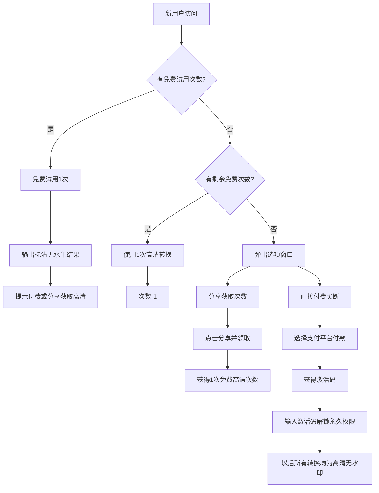

---

## 🧩 前端功能模块详解

### 1. 文件转换核心
- 所有处理均在浏览器端完成，不上传服务器。
- 通过 Web Worker 处理音频、视频等重任务，防止页面卡顿。
- 视频转GIF使用 `FFmpeg.wasm`，在浏览器中直接完成转换。

### 2. 输出质量控制
- **免费试用模式**：自动降低清晰度。
  - 图片：限制分辨率 ≤ 1280px，JPEG quality 0.6
  - PDF：内部图片压缩质量 0.5，或限制页数 ≤ 3
  - 音频：比特率限制为 128kbps
  - 视频转GIF：限制分辨率 ≤ 480p，帧率 ≤ 10fps，时长 ≤ 5秒
- **付费/分享获得的高清模式**：输出原始质量，无水印。

### 3. 试用与权限状态机
- `trial_used` (boolean)：标记新用户是否已用掉唯一一次免费试用。
- `license_plan` ('none' | 'image' | 'image_pdf' | 'audio' | 'all')：当前激活的套餐。
  - `'none'`：未付费
  - `'image'`：$1.99 档
  - `'image_pdf'`：$2.99 档
  - `'audio'`：$3.99 档（含图片+PDF+音频）
  - `'all'`：$4.99 档（含所有工具，包括视频转GIF、压缩、PDF合并拆分等）
- `free_uses` (number)：剩余免费高清使用次数（通过分享获得）。
- `share_data` 对象：记录当天分享次数及上次领取时间。
- 所有状态存于 localStorage，密钥需有特定前缀以避免冲突。

**安全加固 — 权限验证流程**
- localStorage 仅作为**缓存层**，不视为权限的权威来源。
- 付费激活后，Cloudflare Worker 返回 **HMAC 签名的权限令牌**（含 `license_plan`、过期时间、设备指纹哈希）。
- 前端执行付费功能前，先校验令牌签名是否有效、是否过期。
- 令牌附带校验和存储，篡改后签名校验失败，功能自动降级为试用模式。
- 免费试用和分享次数计数器同样附加哈希校验，阻止通过 DevTools 随意修改。

### 4. 分享换次数模块 (`sharing.js`)
- 生成包含网站链接的分享文案。
- 提供"复制链接"按钮和调用 Web Share API 的"一键分享"按钮。
- 点击"我已分享，领取次数"按钮后：
  - 检查当天分享次数 < 5 且距上次 ≥ 10s。
  - 通过后 `free_uses` +1，更新 `share_data`。
  - 反馈成功提示。
- **防滥用约束**：
  - 键名经过混淆，计数器与时间戳绑定。
  - 可选远程校验：Worker 端点按 IP+日期限制每日 5 次领取。
  - 定位为"用户心理激励"而非严格防刷系统，接受纯前端方案存在被绕过的可能。

### 5. 付费与激活码模块 (`license.js`)
- **分阶段执行**：先接入 Lemon Squeezy 沙盒跑通全流程，确认稳定后再评估 Paddle。
- 支付流程由 Lemon Squeezy 处理，用户支付后获得激活码。
- 前端提供激活码输入框，提交至 Cloudflare Worker (`/api/verify-license`) 验证。
- Worker 验证成功后：
  - 在 KV 中标记激活码已使用（记录设备指纹哈希、激活时间）。
  - 返回 HMAC 签名的权限令牌，前端存入 localStorage。
  - 同一激活码最多绑定 2 个不同设备，超出后拒绝激活。
- 补差价升级：用户购买更高档位产品获得新激活码，Worker 验证后签发新令牌覆盖旧权限。

### 6. 广告展示逻辑
- 免费用户和试用用户：在工具页面和结果页面展示 AdSense 广告。
- 已付费用户：减少广告（例如仅保留顶部横幅），提升体验。
- 广告代码通过 `adsbygoogle` 异步加载，根据用户状态动态插入或隐藏广告单元。

---

## 🔒 安全架构

### 权限令牌
- Cloudflare Worker 使用 Web Crypto API 生成 HMAC-SHA256 签名令牌。
- 令牌 payload：`{ license_plan, device_hash, issued_at, expires_at }`。
- 令牌有效期 30 天，过期后需重新验证激活码。

### localStorage 防篡改
- 关键字段存储时附带校验和（SHA-256 取前 8 字节，base64 编码）。
- 读取时校验和不匹配则重置为未付费默认值。
- 校验和密钥硬编码在 JS 中，增加静态分析的逆向难度。

### Worker 端点
| 端点 | 用途 |
|:---|:---|
| `POST /api/verify-license` | 验证激活码，返回签名令牌 |
| `POST /api/validate-token` | 校验令牌有效性，返回权限信息 |
| `POST /api/share-claim` | (可选) 记录分享领取，按 IP+日期限频 |

### 设计原则
- 不引入 JWT 等外部依赖，Worker 原生 Web Crypto 约 30 行完成签名验证。
- 所有安全校验在 Worker 端完成，前端仅缓存结果。

---

## 💳 支付集成（双轨并行测试）

本项目将同时测试 **Lemon Squeezy** 和 **Paddle**，优先使用审核通过且运行稳定的平台。

### 首选：Lemon Squeezy
- 注册门槛低，支持个人开发者，无需人工审核。
- 自动处理全球税务（包括欧盟VAT）。
- 支持生成许可证密钥（License Keys），适合买断制。
- **风险提示**：有开发者反馈自测交易后账号被风控，建议仅使用沙盒测试，不要用自己的卡进行真实付款测试。

### 备选：Paddle
- 对 SaaS 和数字产品更友好，平台稳定性高。
- 同样代缴全球税，合规性更强。
- 开通流程需要**主动联系客服提交审核**，提供网站域名、产品列表、定价及退款政策说明。审核通过后即可获得 API 密钥并集成。
- **提现回国建议**：使用 **Paddle → Wise → 国内银行卡** 路径，手续费低且安全可靠。

### 产品与价格配置（适用于任一平台）
| 产品名称 | 价格 | 对应权限 `license_plan` |
|:---|:---|:---|
| Image Toolkit Lifetime | $1.99 | `'image'` |
| Image + PDF Toolkit Lifetime | $2.99 | `'image_pdf'` |
| Image + PDF + Audio Toolkit Lifetime | $3.99 | `'audio'` |
| All Access Toolkit Lifetime | $4.99 | `'all'` |

### Webhook 通用流程
1. 支付平台在用户成功付款后，向你的 Cloudflare Worker 发送 `order_created` 事件。
2. Worker 解析订单中的产品 variant ID，映射为对应的 `license_plan`，生成一个唯一激活码，存入 Cloudflare KV。
3. 激活码通过邮件发送给用户（可集成 SendGrid 或 Resend 免费额度），或直接在 Worker 返回的页面展示。
4. 用户在前端输入激活码，Worker 验证后返回权限信息，前端存入 localStorage 完成解锁。

---

## 🚀 部署流程

### 1. 购买域名
- 推荐 Namecheap 或 Cloudflare Registrar 注册 `.com` 域名。

### 2. DNS 设置
- 将域名 Nameservers 修改为 Cloudflare 提供的地址。
- 在 Cloudflare DNS 面板添加记录：
  - 4 条 A 记录指向 `185.199.108.153`、`185.199.109.153`、`185.199.110.153`、`185.199.111.153`
  - 1 条 CNAME 记录 `www` 指向 `你的用户名.github.io`
- 开启 Cloudflare 的 CDN 和 SSL/TLS 设置为 Full (strict)。

### 3. GitHub 仓库与 Pages
- 创建公开仓库，将项目代码推送至 `main` 分支。
- 在仓库根目录添加 `CNAME` 文件，内容为你的域名（不带 https://）。
- 进入 Settings > Pages：
  - Source: Deploy from a branch，选择 `main` 分支，`/ (root)` 目录。
  - Custom domain: 填入你的域名，勾选 **Enforce HTTPS**。

### 4. 验证上线
- 等待 DNS 生效（几分钟至几小时）。
- 访问 `https://你的域名.com`，确认显示正常且带有小锁标志。

---

## 📈 Google AdSense 申请

### 前提条件
- 网站具备 **15 篇以上原创、内容丰富的页面**（工具介绍、教程、对比指南等）。
- 必须包含 **隐私政策** 页面，明确说明使用 Google AdSense 和 cookies。
- 拥有独立的 `关于我们` 和 `联系方式` 页面。
- 全站 HTTPS 且移动端适配良好。

### 步骤
1. 访问 [Google AdSense](https://www.google.com/adsense) 用 Gmail 注册。
2. 添加你的网站，获取验证代码，将其粘贴到网站 `<head>` 中。
3. 提交审核，通常需 2 周左右。
4. 审核通过后，在广告单元中获取代码，嵌入页面中。

### 常见拒绝原因
- 内容不足或为低质量翻译/采集内容。
- 缺少隐私政策。
- 网站结构混乱或存在大量 404 页面。

**建议**：先运营 2-4 周，获得日均 100+ 自然流量后再提交申请，通过率更高。

---

## 🗺️ 用户全流程路径

---

## 📋 推荐开发阶段

### 第一阶段：MVP（核心功能 + 试用）
1. 搭建项目骨架：首页、工具页模板、CSS 基础样式。
2. 实现 4 个处理引擎（图片/PDF/音频/视频），均在 Web Worker 中运行。
3. 实现试用状态机（`trial_used` + 输出质量控制）。
4. 部署到 GitHub Pages + Cloudflare，验证全球访问。

### 第二阶段：付费 + 激活
1. 接入 Lemon Squeezy 沙盒，配置 4 个产品 variant。
2. 开发 Cloudflare Worker：激活码生成、验证、令牌签发。
3. 前端集成激活码输入与令牌校验流程。
4. 沙盒测试完整支付→激活→解锁闭环。

### 第三阶段：分享 + 广告
1. 实现分享换次数模块。
2. 撰写 15+ 篇 SEO 教程页面（工具指南、格式对比等）。
3. 提交 Google AdSense 审核。
4. 审核通过后嵌入广告代码，按用户权限动态展示。

### 第四阶段：完善 + 多语言
1. Paddle 集成评估（如 Squeezy 稳定则降低优先级）。
2. 多语言支持（优先 en/es/pt/ja）。
3. 邀请裂变功能。
4. 用户反馈收集与工具迭代。
